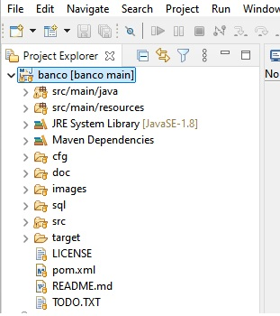
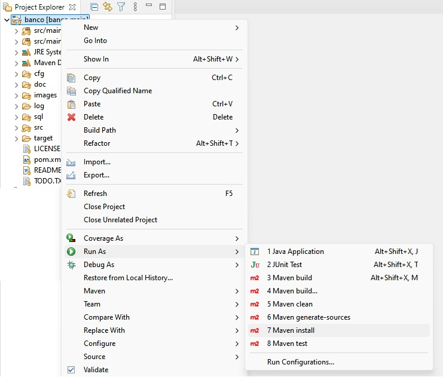
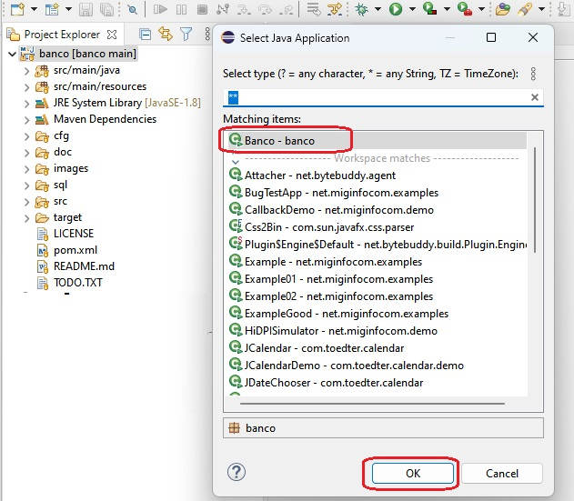

# Banco
 Proyecto de banco con MVC

## Observación respecto a la aplicación

En la aplicación inicial hay opciones para realizar Transferencias y Extracciones,  dichas opciones serán implementadas como parte del proyecto 3 - parte 2  (no están mencionadas en el enunciado del proyecto 3 - parte 1).

## Requisitos del sistema

### 1. Java JDK instalado y configurado (JAVA_HOME y PATH)

### 2. Git

### 3. MySQL o MariaDB

### 4. Eclipse

En eclipse el proyecto debe importarse como un proyecto maven (como esta explicado en la [clase de patrón MVC](https://moodle.uns.edu.ar/moodle/pluginfile.php/1674749/mod_resource/content/2/Clase%20Patr%C3%B3n%20MVC%20en%20Java%20y%20MySQL.pdf) - diapositiva 13). De todas formas, puede correrse como una aplicación java si primeramente se ejecutan algunos comandos maven desde eclipse para poder descargar todas las dependencias. Se deberá ejecutar las siguientes operaciones la primera vez:

- En el Package Explorer del proyecto, tener seleccionada la carpeta raiz del proyecto.<br>


- Hacer click derecho del mouse para desplegar el menú contextual y seleccionar la opción `Run As`, esta opción también está disponible en el menú Run.<br>


- Ejecutar la opción `Maven install`. Esto hará que se descarguen todas las dependencias y se compile el proyecto.

- Luego en el mismo menu de `Run As`  ejecutar la opción `1 Java Application` para ejecutar el proyecto y seleccionar la clase `Banco`.
  

### 5. Maven

Aunque el proyecto puede ser ejecutado desde Eclipse u otro IDE se recomienda instalar [Maven](https://maven.apache.org/index.html). 
Aquí hay una guía rápida de este software [Maven en 5 minutos](https://maven.apache.org/guides/getting-started/maven-in-five-minutes.html).

## Como generar un jar con las dependencias

Para generar con maven el archivo jar existen varias formas que dependerá del momento en que lo estemos realizando y lo que quisieramos que se modifique.

### Generar el jar inicial

Cuando es la primera vez que vamos a generar el jar, necesitamos que maven compile el codigo fuente y que descargue todas las dependencias que se encuentran especificadas en el archivo pom.xml. Por esa razón, deberemos ejecutar en la carpeta principal del proyecto el siguiente comando
```bash
mvn package
```
Una explicación sobre las distintas fases de maven la puede encontrar [aqui](https://maven.apache.org/guides/getting-started/maven-in-five-minutes.html#running-maven-tools). Allí puede verse que package es una de las fases del ciclo de vida por defecto (Default).

### Borrar todo lo generado previamente por maven 

Para borrar las compilaciones previas y dependecias generadas o descargadas de puede ejecutar el comando:
```bash
mvn clean
```
También se puede ejecutar ambos ciclos de vida juntos, produciendo que se borre todo y se compile todo nuevamente.
```bash
mvn clean package
```
## Como ejecutar un proyecto

En primer lugar es necesario disponer de un archivo JAR o WAR (si fuera una aplicación web) que usualmente estará alojado en la carpeta target del proyecto. 

Para ejecutar el proyecto, nos ubicamos donde está el archivo JAR, y lo ejecutamos con java y la opción -jar seguido del nombre del archivo.

```bash
cd target
java -jar banco-jar-with-dependencies.jar
```
También está disponible la opción de ejecución con el plugin de maven a traves del siguiente comando
```bash
maven exec:exec
```

# IMPORTANTE
Para que la aplicación se ejecute correctamente es necesario que la carpeta *'cfg'* (que contiene los archivos de configuracion) se encuentre en la misma carpeta que el archivo JAR.
